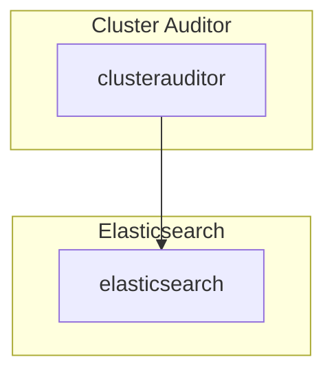

# Cluster Auditor

## Overview

Cluster Auditor(CA) collects opa objects in the cluster and sends them to [elasticsearch](https://repo1.dso.mil/platform-one/big-bang/apps/core/elasticsearch-kibana).  The list of objects collected can be found in this [ConfigMap](https://repo1.dso.mil/platform-one/big-bang/apps/core/cluster-auditor/-/blob/main/chart/templates/configMap.yaml).

## Big Bang Touchpoints



##High Availability

HA can be configured by increasing the "count" or number of replicas of the [deployment](https://repo1.dso.mil/platform-one/big-bang/apps/core/cluster-auditor/-/blob/main/chart/templates/deployment.yaml).

```yaml
...
spec:
  strategy:
    type: RollingUpdate
  selector:
    matchLabels:
      engine: fluentd
  replicas: 1
...
```

##Storage

Cluster Auditor has no storage requirements.

## Single Sign On (SSO)

CA does not have SSO Integration.

## Licensing

CA parent image is `fluentd` which uses  [Apache License 2.0](https://github.com/fluent/fluentd/blob/master/LICENSE).

