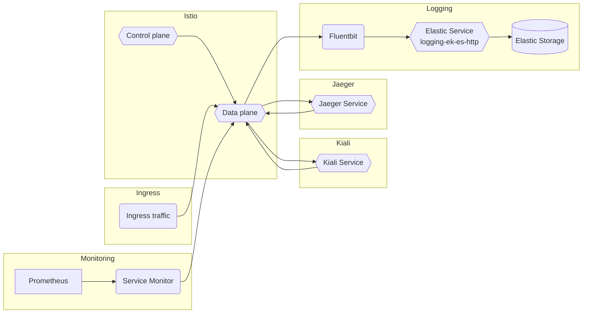

# Istio

## Overview

[Istio](https://istio.io/latest/docs/concepts/what-is-istio/) is an open platform for providing a uniform way to [integrate microservices](https://istio.io/latest/docs/examples/microservices-istio/), manage [traffic flow](https://istio.io/latest/docs/concepts/traffic-management/) across microservices, enforce policies and aggregate telemetry data. Istio's control plane provides an abstraction
layer over the underlying cluster management platform, such as Kubernetes.

## Big Bang Touchpoints

### Licensing

Istio is an open source tool that utilizes an Apache-2.0 License.

### Single Sign On

With Authservice, Kiali, and Jaeger, Istio can be configured to use Keycloak/OIDC auth. For documentation on how to configure Istio with Authservice, Kiali, and Jaeger, see  Istio's [KEYCLOAK.md](https://repo1.dso.mil/platform-one/big-bang/apps/core/istio-controlplane/-/blob/main/docs/KEYCLOAK.md).

### Storage

### High Availability

### UI

With SSO enabled, Istio will be configured to use [Kiali](https://repo1.dso.mil/platform-one/big-bang/apps/core/kiali) (a management console that provides dashboards, observability, and other robust capabilities) and [Jaeger](https://repo1.dso.mil/platform-one/big-bang/apps/core/jaeger) (an end-to-end distributed tracing system), both of which include UI features to help you visualize your mesh.

### Logging

Within Big Bang, logs are captured by fluentbit and shipped to elastic by default.

### Monitoring

Monitoring is enabled by default in the Istio [values.yaml](https://repo1.dso.mil/platform-one/big-bang/apps/core/istio-controlplane/-/blob/main/chart/values.yaml#L21-22) to automatically capture metrics from the monitoring packages.

### Healthchecks

The Iron Bank/Registry1 Istio Dockerfiles include healthchecks for all images.

### Dependant Packages

- Authservice
- Kiali
- Jaegar