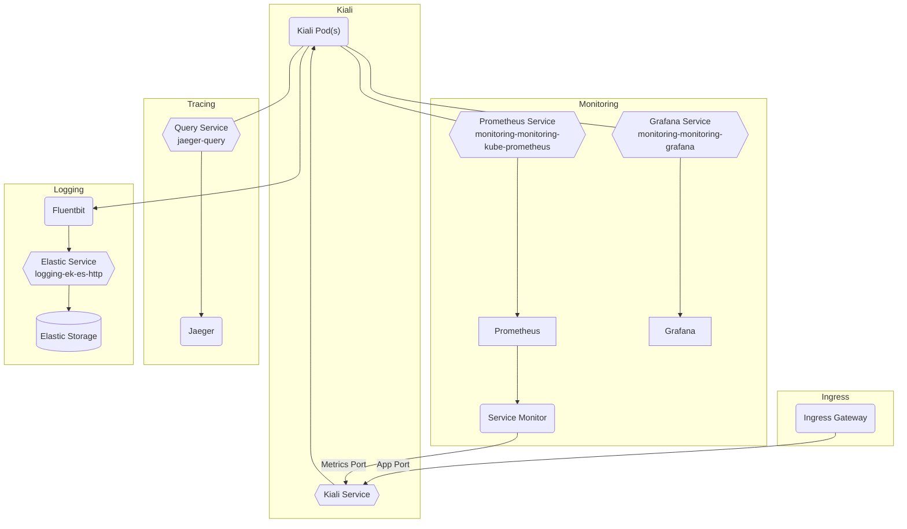

# Kiali

## Overview

[Kiali](https://kiali.io/) is a console for managing an Istio service mesh. It provides graphical views of interactions, metrics, and configuration options for the mesh. To aggregate this data it interacts with Prometheus, Grafana, and Jaeger.

Big Bang's implementation uses the [Kiali operator](https://github.com/kiali/kiali-operator) to provide custom resources and manage the application.

## Big Bang Touch Points

### Storage

## High Availability

## Single Sign on (SSO)

## Licencing

## Dependencies

