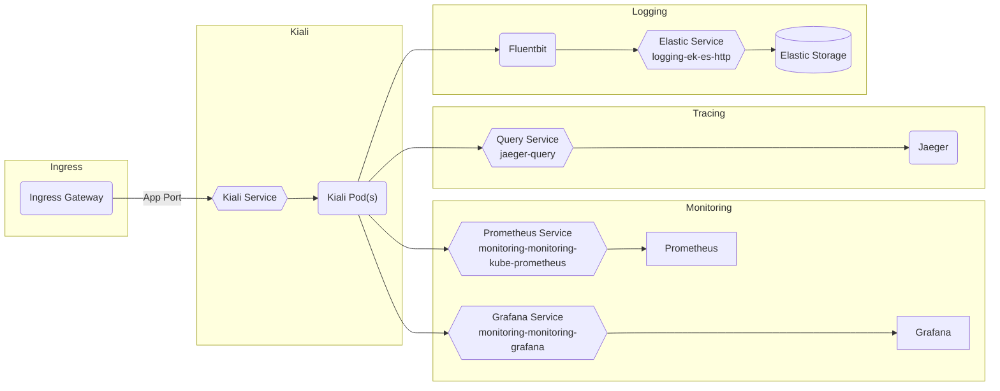

# Kiali

## Overview

[Kiali](https://kiali.io/) is a console for managing an Istio service mesh. It provides graphical views of interactions, metrics, and configuration options for the mesh. To aggregate this data it interacts with Prometheus, Grafana, and Jaeger.

Big Bang's implementation uses the [Kiali operator](https://github.com/kiali/kiali-operator) to provide custom resources and manage the deployment.

## Big Bang Touch Points



### Storage

Kiali does not have any persistent storage, all data is accessed from Jaeger/Monitoring which have their own persistent storage needs/uses (see their respective architecture docs for more info).

### High Availability

HA can be done for Kiali via two methods. You can directly control the replicas required or have Kiali create and use a horizontal pod autoscaler and set a min/max number of replicas for the deployment. Both methods are shown below:

- Specific number of replicas
```yaml
kiali:
  values:
    cr:
      spec:
        deployment:
          replicas: 3
```

- HPA with min/max replicas
```yaml
kiali:
  values:
    cr:
      spec:
        deployment:
          hpa:
            spec:
              maxReplicas: 5
              minReplicas: 3
```

### Single Sign on (SSO)

SSO for Kiali is done via [built in OIDC](https://kiali.io/documentation/latest/configuration/authentication/openid/). Big Bang abstracts and simplifies the settings required for SSO setup. The following values can be used to configure SSO for Kiali:

```yaml
kiali:
  sso:
    enabled: true
    client_id: platform1_a8604cc9-f5e9-4656-802d-d05624370245_bb8-kiali
    client_secret: your_client_secret_or_empty_string
# Kiali inherits/uses the global SSO settings for the host/realm
sso:
  oidc:
    host: login.dso.mil
    realm: baby-yoda
```

If you require a more advanced SSO configuration there are additional ways to customize that are detailed in the [upstream OIDC docs](https://kiali.io/documentation/latest/configuration/authentication/openid/). This doc includes details on how to configure username, scope, timeout, proxies, and more. It also lists some [SSO provider specifics](https://kiali.io/documentation/latest/configuration/authentication/openid/#_provider_specific_instructions) which may be needed for configuring with different providers. If you want to provide any further configuration than what is included in the `kiali.sso` block, you can pass values via `kiali.values.cr.spec.auth`.

### Licensing


### Dependencies

