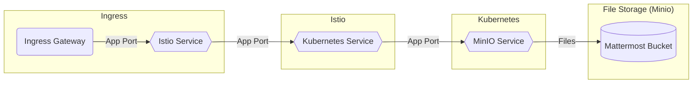

# MinIO

## Overview

[MinIO](https://minio.io/) is a high performance, Kubernetes-native object storage suite.


## Big Bang Touchpoints

### MinIO is Used with Mattermost



### Licensing

MinIO is 100% open source under the Apache V2 license and Affero General Public License Version 3 (AGPLv3).

### Single Sign On


### Storage

MinIO automatically generates one Persistent Volume Claim (PVC) for each volume in the cluster. The cluster must have an equal number of Persistent Volumes (PV). MinIO strongly recommends using locally-attached storage to maximize performance and throughput.

The following steps create the necessary StorageClass and local Persistent Volumes (PV) resources such that each MinIO Pod and their associated storage are local to the same Node.

You can skip this step if the cluster already has local PV resources and a StorageClass configured for use by the MinIO Tenant.

a. Create a StorageClass for the MinIO local Volumes

The following YAML describes a StorageClass with the appropriate fields for use with the local PV:

```yaml
apiVersion: storage.k8s.io/v1
kind: StorageClass
metadata:
   name: local-storage
provisioner: kubernetes.io/no-provisioner
volumeBindingMode: WaitForFirstConsumer
```

The StorageClass must have volumeBindingMode set to WaitForFirstConsumer to ensure correct binding of each pod’s Persistent Volume Claims (PVC) to the Node’s local PV.

### High Availability

MinIO supports Bucket Replication in baremetal installations. Bucket Replication is designed to replicate selected objects in a bucket to a destination bucket.

### UI

MinIO Console provides a graphical user interface for MinIO

### Logging

MinIO supports currently two target types

    console
    http

Console Target

Console target is on always and cannot be disabled.

HTTP Target

HTTP target logs to a generic HTTP endpoint in JSON format and is not enabled by default. To enable HTTP target logging you would have to update your MinIO server configuration using mc admin config set command.

Assuming mc is already configured

mc admin config get myminio/ logger_webhook
logger_webhook:name1 auth_token="" endpoint=""

mc admin config set myminio logger_webhook:name1 auth_token="" endpoint="http://endpoint:port/path"

mc admin service restart myminio

### Monitoring

MinIO server can be monitored with Prometheus.  MinIO exports Prometheus compatible data by default as an authorized endpoint at /minio/v2/metrics/cluster. Users looking to monitor their MinIO instances can point Prometheus configuration to scrape data from this endpoint. This document explains how to setup Prometheus and configure it to scrape data from MinIO servers.  (https://docs.min.io/docs/how-to-monitor-minio-using-prometheus.html)

### Healthchecks

### Dependant Packages

There are no package dependencies for MinIO