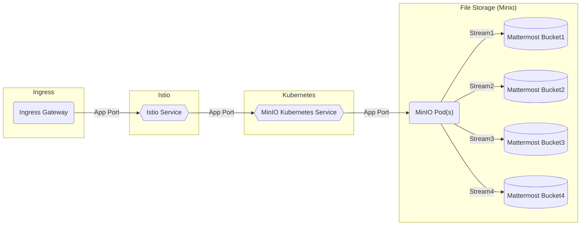

# MinIO

## Overview

[MinIO](https://minio.io/) is a high performance, Kubernetes-native object storage suite.


## Big Bang Touchpoints

### MinIO is Used with Mattermost and can be used with any service that needs object storage.



### Licensing

MinIO is 100% open source under the Apache V2 license and Affero General Public License Version 3 (AGPLv3).

### Single Sign On


### Storage

MinIO automatically generates one Persistent Volume Claim (PVC) for each volume in the cluster. The cluster must have an equal number of Persistent Volumes (PV). MinIO strongly recommends using locally-attached storage to maximize performance and throughput.

The following steps create the necessary StorageClass and local Persistent Volumes (PV) resources such that each MinIO Pod and their associated storage are local to the same Node.

You can skip this step if the cluster already has local PV resources and a StorageClass configured for use by the MinIO Tenant.

a. Create a StorageClass for the MinIO local Volumes

The following YAML describes a StorageClass with the appropriate fields for use with the local PV:

```yaml
apiVersion: storage.k8s.io/v1
kind: StorageClass
metadata:
   name: local-storage
provisioner: kubernetes.io/no-provisioner
volumeBindingMode: WaitForFirstConsumer
```

The StorageClass must have volumeBindingMode set to WaitForFirstConsumer to ensure correct binding of each pod’s Persistent Volume Claims (PVC) to the Node’s local PV.

### High Availability

MinIO supports Bucket Replication in baremetal installations. Bucket Replication is designed to replicate selected objects in a bucket to a destination bucket. 

Customers can also change the number of servers and volumes per server in the values file.

### UI

MinIO Console provides a graphical user interface for MinIO

### Logging

All logs are sent to Elastic via FluentBit by default in a BigBang install.

MinIO also supports logging to the console of the MinIO UI.

Console target is always on and cannot be disabled.


### Monitoring

MinIO server can be monitored with Prometheus.  MinIO exports Prometheus compatible data by default as an authorized endpoint at /minio/v2/metrics/cluster. Users looking to monitor their MinIO instances can point Prometheus configuration to scrape data from this endpoint. This document explains how to setup Prometheus and configure it to scrape data from MinIO servers.  (https://docs.min.io/docs/how-to-monitor-minio-using-prometheus.html)

If a customer enables monitoring in their BigBang values file, the setup for scraping metrics is automatically done.

### Healthchecks

### Dependant Packages

MinIO deploys making use of the MinIO operator being enabled in the BigBang values file.