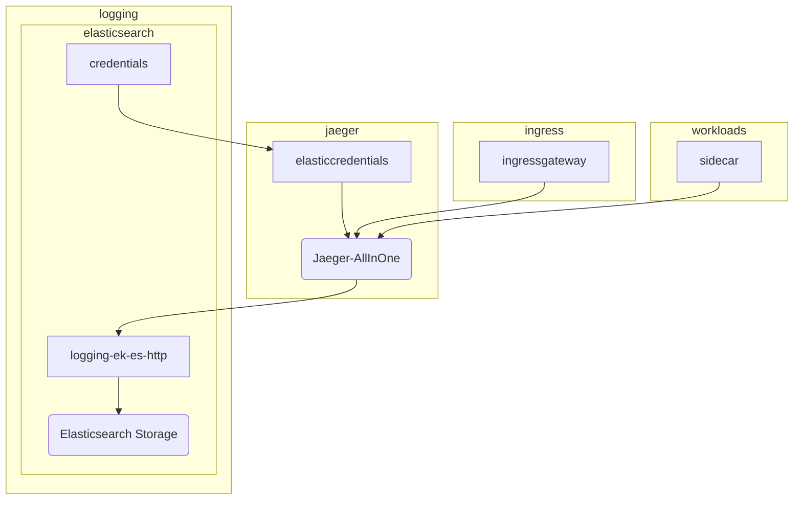
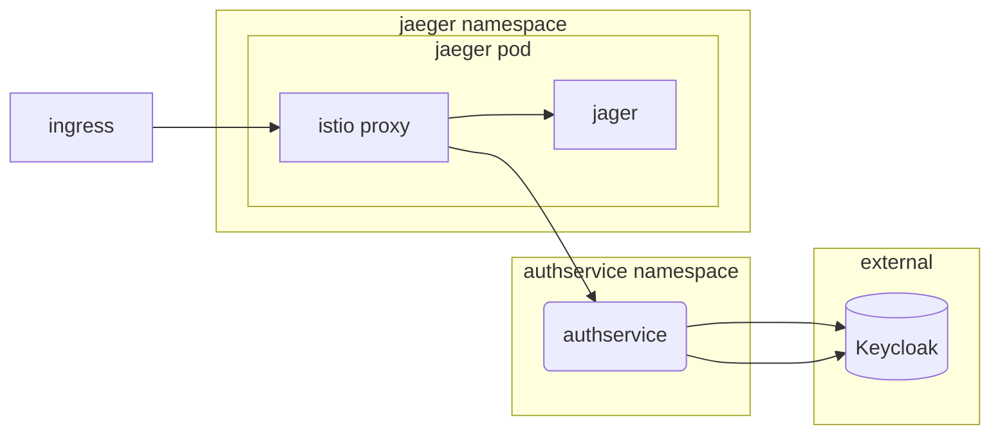

# Sonarqube

## Overview

[Sonarqube](https://www.sonarqube.org/) is an open-source platform for continuous inspection of code quality to perform automatic reviews with static analysis of code to detect bugs, code smells, and security vulnerabilities.

## Big Bang Touchpoints



### Storage


### Istio Configuration


```yaml

```

## High Availability


```yaml
```


## Single Sign on (SSO)

Jaeger does not have built in SSO.  In order to provide SSO, this deployment legerages [Authservice]().



## Licencing


## Storage


## Dependencies


