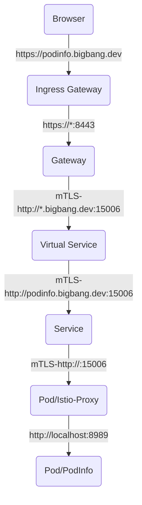

# Big Bang Package: Flux Integration

Big Bang uses a continuous deployment tool, [Flux](https://fluxcd.io/) to deploy packages using Helm charts sourced from Git ([GitOps](https://www.weave.works/technologies/gitops/)).  This document will cover how to integrate a Helm chart, from a mission application or other package, into the Flux pattern required by Big Bang.  Once complete, you will be able to deploy your package with Big Bang.

[[_TOC_]]

## Prerequisites

- [Helm](https://helm.sh/docs/intro/install/)
- [Kubectl](https://kubernetes.io/docs/tasks/tools/#kubectl)
- [Git](https://git-scm.com/book/en/v2/Getting-Started-Installing-Git)
- A multi-node Kubernetes cluster to deploy Big Bang and your package
- A [Big Bang project containing the upstream Helm chart](./package-integration-upstream.md)

> Throughout this document, we will be setting up an application called `podinfo` as a demonstration

## Flux Helm Chart

The purpose of the Flux Helm chart is to create a Big Bang compatible, easy-to-use spec for deploying the package. Reasonable and safe defaults are provided and any needed secrets are auto-created. We accept the trade-off of easy deployment for complicated template code. Details are in the following steps.

   ```shell
   gitrepository.yaml    # Flux GitRepository, configured by Big Bang chart values.
   helmrelease.yaml      # Flux HelmRelease, configured by Big Bang chart values.
   namespace.yaml        # Namespace creation and configuration
   imagepullsecret.yaml  # Secret creation for image pull credentials
   values.yaml           # Big Bang customization of the package and passthrough values.
   ```

Create a new Helm chart for Flux resources in the root of your Git repository:

```shell
# short name of the package
export PKGNAME=podinfo

# version of the package in semver format
export PKGVER=6.0.0

# Make directory structure
mkdir -p flux/templates/$PKGNAME

# Create values file
touch flux/values.yaml

# Copy helpers from Big Bang
curl -sL -o flux/templates/_helpers.tpl https://repo1.dso.mil/platform-one/big-bang/bigbang/-/raw/master/chart/templates/_helpers.tpl

# Create chart file
cat << EOF >> flux/Chart.yaml
apiVersion: v2
name: flux-$PKGNAME
description: Flux compatible Helm chart for $PKGNAME
type: application
version: 0.1.0
appVersion: "$PKGVER"
EOF
```

### Namespace

The package will be deployed in its own namespace.  BigBang pre-creates this namespace so that labels and annotations can be controlled.  Setup `flux/templates/$PKGNAME/namespace.yaml` with the following:

```yaml
{{- $pkg := "podinfo" }}
{{- $component := "sandbox" }}
{{- if (get .Values $pkg).enabled }}
apiVersion: v1
kind: Namespace
metadata:
  name: {{ $pkg }}
  labels:
    app.kubernetes.io/name: {{ $pkg }}
    app.kubernetes.io/component: {{ $component | quote }}
    {{- include "commonLabels" . | nindent 4}}
    {{- if .Values.istio.enabled }}
    istio-injection: "enabled"
    {{- end }}
{{- end }}
```

In order for the namespace Helm template to be properly created, the following values need to be added to `flux/values.yaml`:

```yaml
# Identifies if our package should be deployed or ignored
podinfo:
  enabled: true
```

### Flux Custom Resources

#### GitRepository

Flux's source controller uses the [GitRepository](https://fluxcd.io/docs/components/source/gitrepositories/) resource to pull Helm chart changes from Git.  Use the [GitRepository API Specification](https://fluxcd.io/docs/components/source/gitrepositories/#specification) to create a `GitRepository` resource named `flux/templates/$PKGNAME/gitrepository.yaml` with the following content:

```yaml
{{- $pkg := "podinfo" }}
{{- $component := "sandbox" }}
{{- if (get .Values $pkg).enabled }}
apiVersion: source.toolkit.fluxcd.io/v1beta1
kind: GitRepository
metadata:
  name: {{ $pkg }}
  namespace: {{ .Release.Namespace }}
  labels:
    app.kubernetes.io/name: {{ $pkg }}
    app.kubernetes.io/component: {{ $component | quote }}
    {{- include "commonLabels" . | nindent 4}}
spec:
  interval: {{ .Values.flux.interval }}
  url: {{ (get .Values $pkg).git.repo }}
  ref:
    {{- include "validRef" (get .Values $pkg).git | nindent 4 }}
  {{ include "gitIgnore" . }}
  {{- include "gitCreds" . | nindent 2 }}
{{- end }}
```

The `GitRepository` Helm template above requires the following values to be added to `flx/values.yaml`:

```yaml
podinfo:
  # The Git location of the package Helm chart
  git:
    repo: https://repo1.dso.mil/platform-one/big-bang/apps/sandbox/podinfo
    branch: master
```

> If you are working on a branch, change `master` to the branch you are working from in the values above.

#### HelmRelease

Big Bang exclusively uses Helm charts for deployment through Flux.  Using the [HelmRelease API Specification](https://fluxcd.io/docs/components/helm/helmreleases/#specification), create a `HelmRelease` resource named `flux/templates/$PKGNAME/helmrelease.yaml` with the following content:

```yaml
{{- $pkg := "podinfo" }}
{{- $component := "sandbox" }}
{{- $fluxSettings := merge (get .Values $pkg).flux .Values.flux -}}
{{- if (get .Values $pkg).enabled }}
apiVersion: helm.toolkit.fluxcd.io/v2beta1
kind: HelmRelease
metadata:
  name: {{ $pkg }}
  namespace: {{ .Release.Namespace }}
  labels:
    app.kubernetes.io/name: {{ $pkg }}
    app.kubernetes.io/component: {{ $component | quote }}
    {{- include "commonLabels" . | nindent 4}}
spec:
  targetNamespace: {{ $pkg }}
  chart:
    spec:
      chart: {{ (get .Values $pkg).git.path }}
      interval: 5m
      sourceRef:
        kind: GitRepository
        name: {{ $pkg }}
        namespace: {{ .Release.Namespace }}

  {{- toYaml $fluxSettings | nindent 2 }}

  {{- if (get .Values $pkg).postRenderers }}
  postRenderers:
  {{ toYaml (get .Values $pkg).postRenderers | nindent 4 }}
  {{- end }}
  valuesFrom:
    - name: {{ .Release.Name }}-{{ $pkg }}-values
      kind: Secret
      valuesKey: "common"
    - name: {{ .Release.Name }}-{{ $pkg }}-values
      kind: Secret
      valuesKey: "defaults"
    - name: {{ .Release.Name }}-{{ $pkg }}-values
      kind: Secret
      valuesKey: "overlays"

  {{- if .Values.gatekeeper.enabled }}
  dependsOn:
    {{- if .Values.gatekeeper.enabled }}
    - name: gatekeeper
      namespace: {{ .Release.Namespace }}
    {{- end }}
  {{- end }}
{{- end }}
```

The following values need to be added into `flux/values.yaml` for `HelmRelease`:

```yaml
podinfo:
  # Directory in git where Helm chart is located
  git:
    path: chart
  # Flux specific settings for package
  flux: {}
```

### ImagePullSecret

Big Bang images are pulled from Iron Bank.  In order to provide credentials for Iron Bank, Big Bang will create a secret for each package called `private-registry`.  In `flux/templates/$PKGNAME/imagepullsecret.yaml`, add the following content:

```yaml
{{- $pkg := "podinfo" }}
{{- $component := "sandbox" }}
{{- if (get .Values $pkg).enabled }}
{{- if ( include "imagePullSecret" . ) }}
apiVersion: v1
kind: Secret
metadata:
  name: private-registry
  namespace: {{ $pkg }}
  labels:
    app.kubernetes.io/name: {{ $pkg }}
    app.kubernetes.io/component: {{ $component | quote }}
    {{- include "commonLabels" . | nindent 4}}
type: kubernetes.io/dockerconfigjson
data:
  .dockerconfigjson: {{ template "imagePullSecret" . }}
{{- end }}
{{- end }}
```

> Other secrets can be added for credentials, certificates, etc. by creating a file names `secret-<name>.yaml`.  Big Bang is responsible for creating these secrets using values from the user.  More details are included in the integration documentation for databases, object stores, sso, etc.

### Package Values

Package values (chart/values.yaml) should contain upstream values plus any placeholders of values needed for Big Bang.The following guidelines should be used when adding values to the package:

- Assume the package will be run without Big Bang.  Values enabling features from other packages (e.g. metrics, ingress, SSO) should be turned off by default.  Big Bang will enable them through overrides.
- Re-use existing chart values rather than adding new ones when possible.
- Only change the default values from the upstream Helm chart when necessary.
- Comment any changes made to the upstream Helm values so it is clear that the changes should carry forward on upgrades.
- Assume that Big Bang will create secrets (e.g. TLS certificates, credentials) and provide the reference to the chart.
- Create blank placeholders for Big Bang values to avoid Helm errors during deployment.

### Override Values

Big Bang has a few options for overwriting values in packages.  The package's `HelmRelease`, that we created earlier, contains a `ValuesFrom` section that references a secret with `common`, `default`, and `overlay` keys.  Each of these keys can contain a set of override values that get passed down to the package.  Here is a table explaining the difference between the possible overlays:

|Name|Description|Source|Priority|
|--|--|--|--|
| `overlay` | Values provided by user when deploying Big Bang | `flux/values.yaml`:`$PKGNAME.values.*` | Highest 1 |
| `default` | Values created by Big Bang | `flux/templates/$PKGNAME/values.yaml`:`*` | 2 |
| `common` | Big Bang values common to all packages | Not currently used | 3 |
| `package` | Package defaults | `chart/values.yaml`:`*` | Lowest 4 |

This means that if a user provides a value for the package, that overwrites the value Big Bang or the package would create.

For the package to implement this hierarchy, `flux/templates/$PKGNAME/values.yaml` must be created with the following:

```yaml
{{- $pkg := "podinfo" }}
{{- $component := "sandbox" }}
{{- define "bigbang.defaults.podinfo" -}}

{{- end }}

{{- /* Create secret */ -}}
{{- if (get .Values $pkg).enabled }}
{{- include "values-secret" (dict "root" $ "package" (get .Values $pkg) "name" $pkg "defaults" (include (printf "bigbang.defaults.%s" $pkg) .)) }}
{{- end }}
```

### Check Syntax

At this point, you should have a minimum viable set of values in `flux/values.yaml` that looks like this:

```yaml
podinfo:
  enabled: true
  git:
    repo: https://repo1.dso.mil/platform-one/big-bang/apps/sandbox/podinfo
    branch: bigbang
    path: chart
  flux: {}
```

Use the Big Bang default values to make sure our Helm templates don't have any syntax errors.  Run the following:

   ```shell
   # Get the helm chart
   git clone https://repo1.dso.mil/platform-one/big-bang/bigbang ~/bigbang

   # Check that our chart generates without errors
   helm template -n bigbang bigbang -f ~/bigbang/chart/values.yaml -f flux/values.yaml flux
   ```

### Validation

To validate that the Helm chart is working for Flux, perform the following steps to deploy your package.  This assumes you already have a Kubernetes cluster running.

1. Disable all default packages in Big Bang by adding the following to `flux/values.yaml`

   ```yaml
   # Network Policies
   networkPolicies:
     enabled: false

   # Istio
   istiooperator:
     enabled: false
   istio:
     enabled: false

   # Gatekeeper
   gatekeeper:
     enabled: false
   clusterAuditor:
     enabled: false

   # Logging
   eckoperator:
     enabled: false
   logging:
     enabled: false
   fluentbit:
     enabled: false

   # Monitoring
   monitoring:
     enabled: false

   # Other Tools
   jaeger:
     enabled: false
   kiali:
     enabled: false
   twistlock:
     enabled: false
   ```

1. Install flux using the [instructions from Big Bang](https://repo1.dso.mil/platform-one/big-bang/bigbang/-/blob/1.17.0/docs/guides/deployment_scenarios/quickstart.md#step-8-install-flux).
1. Install the package using the flux Helm chart

   ```shell
   helm upgrade -i -n bigbang --create-namespace -f ~/bigbang/chart/values.yaml -f flux/values.yaml podinfo flux
   ```

1. Watch the `GitRepository`, `HelmRelease`, and `Pods`:

   ```shell
   watch kubectl get gitrepo,hr,po -A
   ```

1. Troubleshoot any errors

> If you are using a private Git repository or pulling images from a private image repository, you will need to add credentials into the `git.credentials.username`/`git.credentials.password` and/or `registryCredentials.username`/`registryCredentials.password` using the `--set` option for Helm.

1. Commit your changes

   ```shell
   git add -A
   git commit -m "feat: added flux helm chart"
   git push
   ```

1. Cleanup cluster

   ```shell
   helm delete -n bigbang podinfo
   ```


## Big Bang Integration

### Istio

[Istio](https://istio.io/) provides the [service mesh](https://istio.io/latest/about/service-mesh/) for Big Bang.  The service mesh assists with secure traffic routing in the cluster.

#### Sidecar

The [Istio sidecar](https://istio.io/latest/docs/reference/config/networking/sidecar/) is a container that can be automatically injected into all package pods to provide encrypted traffic using [mutual TLS](https://istio.io/latest/docs/tasks/security/authentication/authn-policy/#auto-mutual-tls).  It also enables detailed [packet tracing](https://istio.io/latest/docs/tasks/observability/distributed-tracing/jaeger/) and [network traffic metrics](https://istio.io/latest/docs/ops/configuration/telemetry/envoy-stats/).

When Istio is enabled in the values, automatic Istio sidecar injection is added to the namespace by adding the label `istio-injection: "enabled"`.  Most packages are compatible with Istio's sidecar, but if you need to disable this, change the label to `istio-injection: "disabled"`in `flux/templates/$PKGNAME/namespace.yaml`.

#### Virtual Service

If your package has an externally facing service (e.g. URL, port port), you will need to setup a `VirtualService` in Istio to access it from outside the cluster.

> Connections from inside the cluster can use the `Service` and do not require a `VirutalService`

Istio will provide end-to-end encryption for https connections using TLS termination and mutual TLS to the sidecar.  Therefore, the http connection on the package can be used for the virtual service.

##### virtualservice.yaml

Setup `chart/templates/bigbang/virtualservice.yaml` with the following default content:

```yaml
{{- $pkg := "podinfo" }}
{{- if and .Values.istio.enabled (get .Values.istio $pkg).enabled }}
apiVersion: networking.istio.io/v1beta1
kind: VirtualService
metadata:
  name: {{ $pkg }}
  namespace: {{ .Release.Namespace }}
  labels:
    {{- include (printf "%s.labels" $pkg) . | nindent 4 }}
    app.kubernetes.io/instance: {{ .Release.Name }}
spec:
  gateways:
  {{- range (get .Values.istio $pkg).gateways }}
    - {{ . }}
  {{- end }}
  hosts:
  {{- range (get .Values.istio $pkg).hosts }}
    - {{ tpl . $}}
  {{- end }}
  http:
  - route:
    - destination:
        port:
          number: {{ .Values.port | default "8080" }}
        host: {{ $pkg }}.{{ .Release.Namespace }}.svc.cluster.local
{{- end }}
```

The virtual service must be adjusted to make it compatible with the upstream chart by making the following changes:

- Change the service name to use the same pattern as other resources in the package.  For `podinfo`, this is `template "podinfo.fullname" .`.
- Adjust the labels to adhere to the [standard Helm labels](https://helm.sh/docs/chart_best_practices/labels/#standard-labels)
  - Re-use `_helper.tpl` functions from the upstream chart for common labels.  In this case, we are including the helper `podinfo.labels`.
  - Supplement the missing labels from the helper function.  In our case, the helper function was missing `app.kubernetes.io/instance`.
- Typically, there is a value for the http port in `chart/values.yaml`.  Use this in `spec.http[0].route[0].destination.port.number`.  In this case, we need to change `.Values.port` to `.Values.service.externalPort`.
- If your service name is not the same as the package name, you will need to change `spec.http[0].route[0].destination.host` to the service name.  For `podinfo`, it uses the helper `podinfo.fullname` to create the service name.

The final `virtualservice.yaml` looks like this:

```yaml
{{- $pkg := "podinfo" }}
{{- if and .Values.istio.enabled (get .Values.istio $pkg).enabled }}
apiVersion: networking.istio.io/v1beta1
kind: VirtualService
metadata:
  name: {{ template "podinfo.fullname" . }}
  namespace: {{ .Release.Namespace }}
  labels:
    {{- include (printf "%s.labels" $pkg) . | nindent 4 }}
    app.kubernetes.io/instance: {{ .Release.Name }}
spec:
  gateways:
  {{- range (get .Values.istio $pkg).gateways }}
    - {{ . }}
  {{- end }}
  hosts:
  {{- range (get .Values.istio $pkg).hosts }}
    - {{ tpl . $}}
  {{- end }}
  http:
  - route:
    - destination:
        port:
          number: {{ .Values.service.externalPort | default "8080" }}
        host: {{ template "podinfo.fullname" . }}.{{ .Release.Namespace }}.svc.cluster.local
{{- end }}
```

> For configuring a connection for something other than `http`, read  [Istio's documentation on traffic management](https://istio.io/latest/docs/ops/configuration/traffic-management/) to determine the best course of action.

##### Package Defaults

In `chart/values.yaml`, default values for Istio are required as placeholders for the Helm templating.  We should assume that Istio is **not** installed in our defaults.  Add the following content to the values:

```yaml
# Big Bang Values
domain: bigbang.dev
istio:
  enabled: false
  podinfo:
    enabled: true
    gateways:
    - istio-system/main
    hosts:
    - podinfo.{{ .Values.domain }}
```

Some notes on the defaults:

- Always add a comment to modifications made to the upstream chart to assist with upgrading in the future
- `istio-system/main` is the default gateway created by the Istio Helm chart
- The default FQDN is `podinfo.bigbang.dev`, which can be overridden if desired

##### Big Bang Defaults

Set the following in `flux/values.yaml` to enable Istio for integration testing.  These values will be used in the next section:

```yaml
# Update existing values
istiooperator:
  enabled: true
istio:
  enabled: true

# Add new value
podinfo:
  ingress:
    gateway: ""
```

##### Big Bang Passdowns

Big Bang must override the default values for the package to passdown configuration.  It uses `flux/templates/$PKGNAME/values.yaml` to do this.  Add the following content to the `bigbang.defaults.podinfo` definition:

```yaml
{{- define "bigbang.defaults.podinfo" -}}
# hostname is deprecated and replaced with domain. But if hostname exists then use it.
domain: {{ default .Values.domain .Values.hostname }}
istio:
  enabled: {{ .Values.istio.enabled }}
  podinfo:
    gateways:
    - istio-system/{{ default "public" .Values.podinfo.ingress.gateway }}
{{- end }}
```

#### Validation

Test the following items to insure Istio is working properly with your application:

1. Verify syntax and resolve errors:

   ```shell
   helm template -n bigbang -f ~/bigbang/chart/values.yaml -f flux/values.yaml bigbang-test flux
   ```

1. Commit changes

   ```shell
   git add -A
   git commit -m "feat: Istio integration"
   git push
   ```

1. Install Big Bang core with `bigbang.dev` certificate

   ```shell
   # Iron Bank credentials are required since you are pulling Big Bang images from Iron Bank
   helm upgrade -i -n bigbang --create-namespace -f ~/bigbang/chart/values.yaml -f ~/bigbang/chart/ingress-certs.yaml -f flux/values.yaml --set registryCredentials.username=<your Iron Bank username> --set registryCredentials.password=<your Iron Bank PAT> bigbang ~/bigbang/chart
   ```

1. Install the package

   ```shell
   # Iron Bank credentials are optional until we migrate the package to an Iron Bank image
   helm upgrade -i -n bigbang --create-namespace -f ~/bigbang/chart/values.yaml -f ~/bigbang/chart/ingress-certs.yaml -f flux/values.yaml --set registryCredentials.username=<your Iron Bank username> --set registryCredentials.password=<your Iron Bank PAT> podinfo flux
   ```

1. Watch the `GitRepository`, `HelmRelease`, and `Pods` by running `watch kubectl get gitrepo,hr,po -A`.  Istio operator, Istio control plane, and the package should all be installed.

1. Troubleshoot any deployment errors

1. Validate the TLS certificate is in the secret `istio-system/public-cert`.  This is the certificate Istio uses to provide https access to your package from outside the cluster.

   ```shell
   kubectl get secret -n istio-system public-cert -o 'go-template={{ index .data "tls.crt" }}' | base64 -d

   ## OUTPUT ##
   -----BEGIN CERTIFICATE-----
   MIIFYDCCB...
   ```

   > Istio self generates a different certificate for mutual TLS encryption between the Istio control plane and the Istio sidecar inside the pod for traffic into the pod.

1. Validate Istio's Ingress Gateway service is running.  This is the load balancer that listens for traffic coming from outside the cluster.

   ```shell
   kubectl describe services -n istio-system public-ingressgateway

   ## OUTPUT ##
   Name:                     public-ingressgateway
   Namespace:                istio-system
   Labels: ...
   ```

   > Big Bang defaults to a single ingress gateway called `public-ingressgateway`.

   In the description, you can see the following:
   - Type is `LoadBalancer`
   - `status-port` is configured for a health status check on ingress
   - `http` is configured to listen on port 80 and forward to port 8080
   - `https` is configured to listen on port 443 and forward to port 8443
   - LoadBalancer Ingress IPs are external IPs assigned to the load balancer that can be accessed outside of the cluster.

1. Validate Istio's Gateway is configured correctly.  Istio will use the Gateway's configuration for TLS encryption and host/port-based traffic matching.

   ```shell
   kubectl describe gateway -n istio-system

   ## OUTPUT ##
   Name:         public
   Namespace:    istio-system
   Labels: ...
   ```

   > Big Bang defaults to a single `Gateway` called `public`.

   By default the Gateway is setup with the following:

   - Connected to the `public-ingressgateway` using `spec.selector`
   - `http`:
     - Matches traffic for any hostname
     - Listen on port 8080
     - Redirects all traffic to `https`
   - `https`:
     - Matches all hosts in domain (`*.bigbang.dev`)
     - Listen on port 8443
     - Uses TLS certificate from `public-cert` for encryption/decryption

1. Validate the package's virtual service.  The virtual service controls the traffic routing between Istio and the package.

   ```shell
   kubectl describe virtualservice -n podinfo

   ## OUTPUT ##
   Name:         podinfo-podinfo
   Namespace:    podinfo
   Labels:  ...
   ```

   The virtual service should have the following configured:
   - Connection to Istio's `istio-system/public` Gateway using `spec.gateway`
   - Matches specific host for package (`podinfo.bigbang.dev`)
   - Routes `http` traffic to package's service and port.  You can view the service name and `http` port using `kubectl describe service -n podinfo`.

1. Validate Istio's sidecar is running in the package's pod.

   ```shell
   # Get "ready" status of running containers
   kubectl get pods -n podinfo -o jsonpath='{range .items[*].status.containerStatuses[*]}{@.name}{" "}{@.ready}{"\n"}'

   ## OUTPUT ##
   istio-proxy true
   podinfo true
   ```

   > If `istio-proxy` is not listed in the running containers, try restarting your pod.  Use `kubectl get deploy,sts,ds -n podinfo` to get the name and `kubectl rollout restart -n podinfo <name>` to restart it.  Then, check for the `istio-proxy` container again.

1. Check the package's URL

   > The hostname `*.bigbang.dev` points to your local IP address of 127.0.0.1.  If you are running the cluster on a different machine, you will need to add the hostname and host machine's IP to `/etc/hosts`.

   ```shell
   curl -sL https://podinfo.bigbang.dev

   ## OUTPUT ##
   {
     "hostname": "podinfo-podinfo-86b4b9d85c-rnd4z",
     "version": "6.0.0",
     "revision": "",
     "color": "#34577c",
     "logo": "https://raw.githubusercontent.com/stefanprodan/podinfo/gh-pages/cuddle_clap.gif",
     "message": "greetings from podinfo v6.0.0",
     "goos": "linux",
     "goarch": "amd64",
     "runtime": "go1.15.7",
     "num_goroutine": "8",
     "num_cpu": "32"
   }
   ```

You have now verified Istio is working properly with the package.  To recap, incoming traffic to the cluster is first processed by Istio's ingress gateway listening on specific ports on each node.  `http` and `https` traffic is forwarded to internal ports 8080 and 8443 respectively.  The Istio Gateway configuration redirects `http` traffic to `https` and `https` traffic matching the domain (`bigbang.dev`) is TLS decrypted.  The Virtual Service configuration processes `https` traffic from the Gateway matching the package's hostname (`podinfo.bigbang.dev`) and routes traffic to the package's service and `http` port.  The service then directs traffic to the pod for handling.  Since the pod has the Istio sidecar running, the mutual TLS Istio feature will automatically encrypt traffic from the gateway to the pod inside the cluster (even though its http).  The sidecar will then decrypt to package before sending it over to the package for handling.  The following diagram illustrates this flow:

> 15006 is the port reserved for Istio Proxy incoming traffic



As a final test, you can use your browser to navigate to `https://podinfo.bigbang.dev` to see the web user interface for podinfo.

### Network Policies

#### Ingress

#### Egress

### Gatekeeper

### Monitoring

### Keycloak

### MinIO

## DevOps

### Pipeline

### Helm Tests

### Cypress Tests

## Productionization

### Customer Template

### Iron Bank Images

### Promotion into Big Bang

## Documentation

Big Bang requires the following documents to be in the Git repository at the root:

### CHANGELOG.md

The format of the changelog should be based on [Keep a Changelog](https://keepachangelog.com/en/1.0.0/) with versions equivalent to the Helm chart version.

Example:

```markdown
# Changelog
## [6.0.0-bb.0] - 2021-09-30
### Added
- Initial creation of the chart
```

### CODEOWNERS

Code owners are required approvals on merge requests in the Big Bang repository.  This file should be setup based on [GitLab's Code Owners guidance](https://docs.gitlab.com/ee/user/project/code_owners.html).

Example:

```markdown
* @gitlabuser
```

### CONTRIBUTING.md

This document should outline the steps required for someone new to contribute to the repository.

Example:

```markdown
# Contributing

This repository uses the following conventions:

* [Semantic Versioning](https://semver.org/)
* [Keep a Changelog](https://keepachangelog.com/)
* [Conventional Commits](https://www.conventionalcommits.org/)
* [Cypress](https://www.cypress.io) or [Conftest](https://conftest.dev) for testing

Development requires the following tools
- Tool1
- Tool2

To contribute a change:

1. Open an issue in GitLab describe the scope of the work to be done
1. Assign yourself to the issue and label it with "status::doing"
1. Create a branch in the repository
1. Make changes in code and push to your branch
1. Write tests using [cypress](https://www.cypress.io) and [Conftest](https://conftest.dev)
1. Make commits using the [Conventional Commits](https://www.conventionalcommits.org/) format
1. Update `CHANGELOG.md` using the [Keep a Changelog](https://keepachangelog.com)
1. Open a merge request into the `main` branch
1. Add a reference to the issue in the merge request description
1. Resolve any failures from the pipeline
1. Resolve any merge conflicts
1. Label the Merge Request with "status::review"
1. Contact the code owners to expedite your MR review
1. Address any review comments and merge conflicts during the review process.
1. Wait for a code owner to approve and merge your changes
1. Request a repository maintainer to create a release and tag
```

### LICENSE

The license file should contain the license terms and conditions for using the Helm charts.  In general, Big Bang uses the [Apache 2.0 License](https://www.apache.org/licenses/LICENSE-2.0).

### README.md

The readme contains high-level information about the package.  This document covers the following topics:

- Overview: What is in the Git repository
- Prerequisites: What tools do I need to install and use this?
- Install / Upgrade: How do I install / upgrade this?
- Usage: Once it is installed, how do I use this?
- Troubleshooting: What are some common problems and solutions I may run across?
- References: What other documentation exists that I can use to read about this?

Example:

```markdown
# MyPackage

MyPackage does awesome things.  This repo contains an enhanced version of the [Helm charts for MyPackage](https://github.com/helm/charts) that is fully compatible with [Big Bang](https://repo1.dso.mil/platform-one/big-bang/bigbang).

## Prerequisites

The following tools are required to install and use MyPackage:

- [Helm](https://helm.sh/docs/intro/install/)
- [Kubectl](https://kubernetes.io/docs/tasks/tools/#kubectl)
- A running Kubernetes cluster with Big Bang installed using default settings

## Installation

Flux should already be installed on the cluster since it is used by Big Bang.  MyPackage can be installed or upgraded with Flux by running `helm upgrade -i -n bigbang ./flux`.

## Usage

Once installed, you can connect to `https://mypackage.bigbang.dev` to login to MyPackage.

## Troubleshooting

### Timeout connecting to URL

If your browser times out connecting the URL, make sure you have a valid TLS certificate installed in Big Bang.

## References

- [MyPackage Documentation](https://tools.usps.com/)
```
